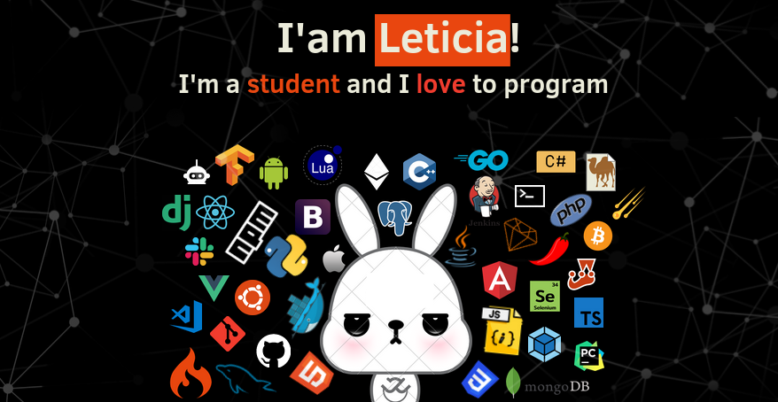

  <h1> Hi there <𝚍𝚎𝚟𝚎𝚕𝚘𝚙𝚎𝚛𝚜/> 👋 </h1>

  

---

<b> 🤔 About me</b>
 

- ⏳️ Computer Engineer in progress ...
- 🌱 I'm currently learning Linux, Vim and other cool stuff!
- ⚡ Fun fact: I have a cat 🐈️ and I like to cook 👩‍🍳️
- 💌️ I love challenges and learning new technologies

<b>:gear: &nbsp;GitHub Statistics</b>
   
  

    
  

    

       

<b>:computer: &nbsp;Technologies</b>
 

  
  
  
  
  
  
  
  

  
  
  
  
  
  
  
  

---

 
  &nbsp;&nbsp;&nbsp;&nbsp;
  &nbsp;&nbsp;&nbsp;&nbsp;

 

 

  

            
<!-- Footer -->
 

<samp>
    

        ════ ⋆★⋆ ════
         
        "Happy Coding👨‍💻!"
    

</samp>

